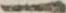
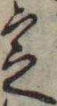
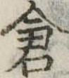

# Kuzushini Example Images
Example Kuzushiji images stored in this directory are from [日本古典籍くずし字データセット](http://codh.rois.ac.jp/char-shape/).
Note that the dataset is provided under [CC BY-SA 4.0](https://creativecommons.org/licenses/by-sa/4.0/), so all images in the [examples/](./) directory are licensed under [CC BY-SA 4.0](https://creativecommons.org/licenses/by-sa/4.0/).

Images in this directory are sampled from the test subset.

*Class: U+4E00 (一)*

*Class: U+5B9A (定)*

*Class: U+5009 (倉)*

## Reference
[『日本古典籍くずし字データセット』](http://codh.rois.ac.jp/char-shape/)（国文研ほか所蔵／CODH加工） doi:10.20676/00000340

提供：[ROIS-DS人文学オープンデータ共同利用センター](http://codh.rois.ac.jp/)
